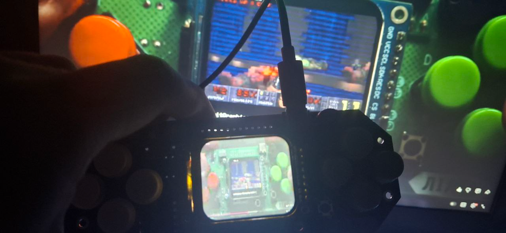

# Lilka Desktop Monitor

Stream your computer screen to [Lilka](https://lilka.dev) device over WiFi using MJPEG. This firmware enables real-time display streaming to Lilka's 1.69" TFT display using efficient JPEG compression and GStreamer.

Based on the ESP32 Desktop Monitor [project](https://github.com/tuckershannon/ESP32-Desktop-Monitor).

## Demo

https://github.com/lilka-dev/mpeg_stream_player/blob/main/docs/video.mp4



## How It Works

```
┌─────────────┐    GStreamer     ┌──────────────┐    TCP/MJPEG    ┌─────────────┐
│   Screen    │ ──────────────►  │  stream.sh   │ ──────────────► │   Lilka     │
│  Capture    │   JPEG encode    │  (280x240)   │    WiFi         │  (ESP32-S3) │
└─────────────┘                  └──────────────┘                 └─────────────┘
```

1. **GStreamer** captures screen, scales to 280x240, encodes as MJPEG
2. **TCP stream** sends JPEG frames to Lilka over WiFi
3. **TJpgDec** library on ESP32-S3 decodes JPEG in real-time
4. **Arduino_GFX** renders frames to ST7789 display

## Hardware Requirements

### Lilka Device
- **Board**: Lilka v2 (ESP32-S3 based)
- **Display**: 1.69" ST7789 TFT LCD (280x240 pixels)
- **Operating System**: KeiraOS (for WiFi configuration)
- **Memory**: PSRAM (for JPEG buffer)

### Computer
- Linux (X11 or PipeWire) or macOS
- GStreamer 1.0 with plugins

## Software Requirements

### Firmware (PlatformIO)
- PlatformIO IDE or CLI
- Libraries (auto-installed):
  - Lilka SDK
  - TJpg_Decoder

### Computer (GStreamer)

**Linux (Debian/Ubuntu):**
```bash
sudo apt install gstreamer1.0-tools gstreamer1.0-plugins-good gstreamer1.0-plugins-base
```

**Linux (Fedora):**
```bash
sudo dnf install gstreamer1 gstreamer1-plugins-good gstreamer1-plugins-base
```

**macOS:**
```bash
brew install gstreamer gst-plugins-good gst-plugins-base gst-plugins-bad
```

## Setup Instructions

### 1. Configure WiFi in KeiraOS

WiFi must be configured in KeiraOS before using this firmware:

1. Boot Lilka into KeiraOS
2. Go to **Settings → WiFi**
3. Select your WiFi network and enter password
4. Credentials are saved automatically

### 2. Build and Flash Firmware

```bash
# Clone the repository
git clone https://github.com/your-repo/lilka-desktop-monitor
cd lilka-desktop-monitor

# Build firmware
pio run

# Upload to Lilka (connect via USB)
pio run --target upload
```

**Or load from SD card:**
1. Copy `.pio/build/lilka_v2/firmware.bin` to SD card
2. In KeiraOS file manager, open the `.bin` file to load it

### 3. Note the IP Address

After firmware loads and connects to WiFi, the display shows:
```
MJPEG Receiver
IP Address:
192.168.x.x
Port: 8090
Waiting for stream...
```

### 4. Start Streaming

```bash
cd transmitter
./stream.sh <LILKA_IP>
```

## Usage

### Basic Usage

```bash
# Stream to Lilka at default settings (15 FPS, quality 50)
./stream.sh 192.168.88.239

# Custom settings
./stream.sh <IP> [PORT] [FPS] [QUALITY]
```

### Command Line Options

| Argument | Default | Description |
|----------|---------|-------------|
| IP | (required) | Lilka device IP address |
| PORT | 8090 | TCP port |
| FPS | 15 | Frames per second (1-30) |
| QUALITY | 50 | JPEG quality (1-100) |

### Examples

```bash
# High quality, lower FPS
./stream.sh 192.168.88.239 8090 10 80

# Fast streaming, lower quality
./stream.sh 192.168.88.239 8090 25 30
```

## Performance

Typical performance on ESP32-S3:

| Quality | FPS | Bandwidth | Decode Time |
|---------|-----|-----------|-------------|
| 30 | 20-25 | ~200 kbps | ~15ms |
| 50 | 15-20 | ~350 kbps | ~20ms |
| 80 | 10-15 | ~600 kbps | ~30ms |

## GStreamer Pipeline

The `stream.sh` script runs this GStreamer pipeline:

```bash
gst-launch-1.0 \
    ximagesrc use-damage=false show-pointer=true ! videoconvert \
    ! queue max-size-buffers=2 leaky=downstream \
    ! videoscale method=lanczos \
    ! video/x-raw,width=280,height=240 \
    ! videorate \
    ! video/x-raw,framerate=15/1 \
    ! videoconvert \
    ! video/x-raw,format=I420 \
    ! jpegenc quality=50 idct-method=ifast \
    ! queue max-size-buffers=2 leaky=downstream \
    ! tcpclientsink host=<IP> port=8090
```

### Custom Pipelines

You can create custom pipelines for specific use cases:

**Stream a specific window (Linux):**
```bash
# Find window ID with xwininfo
gst-launch-1.0 ximagesrc xid=0x12345678 ! ...
```

**Stream a video file:**
```bash
gst-launch-1.0 filesrc location=video.mp4 ! decodebin ! videoconvert \
    ! videoscale ! video/x-raw,width=280,height=240 \
    ! jpegenc quality=50 \
    ! tcpclientsink host=192.168.88.239 port=8090
```

**Stream webcam:**
```bash
gst-launch-1.0 v4l2src device=/dev/video0 ! videoconvert \
    ! videoscale ! video/x-raw,width=280,height=240 \
    ! jpegenc quality=50 \
    ! tcpclientsink host=192.168.88.239 port=8090
```

## Troubleshooting

### "No WiFi configured" error
Configure WiFi in KeiraOS Settings first.

### "Failed to allocate buffers" error
PSRAM may not be available. Ensure you're using Lilka v2 hardware.

### Green/wrong colors
The firmware uses `setSwapBytes(false)`. If colors look wrong, try changing to `true` in `src/main.cpp`.

### Low FPS / high latency
- Lower JPEG quality (30-40)
- Reduce FPS target
- Check WiFi signal strength
- Ensure no other heavy network traffic

### "No suitable screen capture plugin found"
Install GStreamer plugins:
```bash
# Linux
sudo apt install gstreamer1.0-plugins-good

# macOS
brew install gst-plugins-bad
```

### Connection refused
- Verify Lilka IP address
- Ensure Lilka is connected to same network
- Check if port 8090 is not blocked by firewall

## Protocol Details

The firmware receives raw MJPEG stream over TCP. Frames are detected by JPEG markers:
- **SOI** (Start of Image): `0xFFD8`
- **EOI** (End of Image): `0xFFD9`

This is compatible with GStreamer's `jpegenc` output without any additional framing.

## Project Structure

```
lilka-desktop-monitor/
├── src/
│   ├── main.cpp          # MJPEG receiver firmware
│   └── wifi_config.cpp   # WiFi credential handling
├── include/
│   └── wifi_config.h     # WiFi config header
├── transmitter/
│   └── stream.sh         # GStreamer streaming script
├── platformio.ini        # PlatformIO configuration
└── README.md
```

## License

MIT License

## Credits

- [Lilka](https://lilka.dev) - Ukrainian educational game console
- [TJpg_Decoder](https://github.com/Bodmer/TJpg_Decoder) - JPEG decoder for Arduino
- [Arduino_GFX](https://github.com/moononournation/Arduino_GFX) - Display library
- [GStreamer](https://gstreamer.freedesktop.org/) - Multimedia framework
